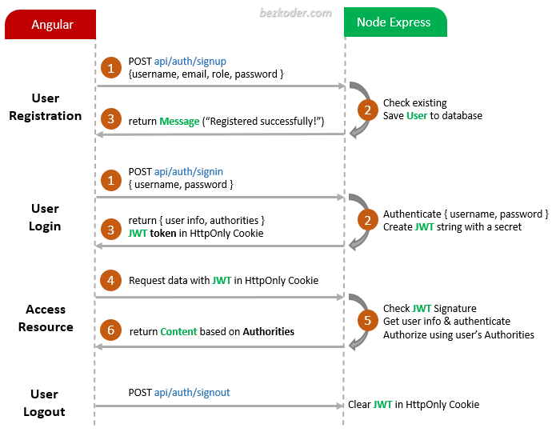

# MEAN stack Authentication and Authorization example

Build MEAN stack JWT Authentication & Authorization example with HttpOnly Cookie and JWT.

## Flow for User Registration and User Login
For JWT – Token based Authentication with Rest API, we’re gonna call 2 endpoints:
- POST `api/auth/signup` for User Registration
- POST `api/auth/signin` for User Login
- POST `api/auth/signout` for User Logout

You can take a look at following flow to have an overview of Requests and Responses:

For more detail, please visit the tutorial:
> [MEAN stack Authentication & Authorization with Angular 13](https://www.bezkoder.com/mean-stack-auth-angular-13/)

> [MEAN stack Authentication & Authorization with Angular 14](https://www.bezkoder.com/mean-stack-auth-angular-14/)

> [MEAN stack Authentication & Authorization with Angular 15](https://www.bezkoder.com/mean-stack-auth-angular-15/)

## Run
### Node.js Server
Run `node server.js` for a dev server exporting API at http://localhost:8080/.

### Angular Client
Run `ng serve --port 8081`. Navigate to `http://localhost:8081/`.

## More practice

Fullstack with Node:

> [Angular 13 + Node Express + MongoDB example](https://www.bezkoder.com/mean-stack-crud-example-angular-13/)

> [Angular 14 + Node Express + MongoDB example](https://www.bezkoder.com/mean-stack-crud-example-angular-14/)

> [Angular 15 + Node Express + MongoDB example](https://www.bezkoder.com/angular-15-node-js-express-mongodb/)

> [Angular 13 + Node Express: File upload example](https://www.bezkoder.com/angular-13-node-express-file-upload/)

> [Angular 14 + Node Express: File upload example](https://www.bezkoder.com/angular-14-node-express-file-upload/)

> [Angular 15 + Node Express: File upload example](https://www.bezkoder.com/angular-15-node-express-file-upload/)

Integration (run back-end & front-end on same server/port)
> [How to integrate Angular with Node Restful Services](https://www.bezkoder.com/integrate-angular-12-node-js/)
